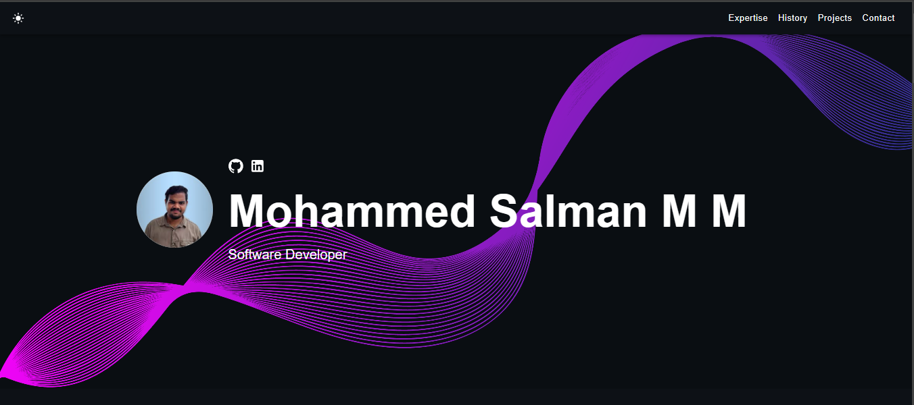

# Portfolio Website 🧑‍💻  

        

## 🌟 About  

This is my **Personal Portfolio Website**, designed to showcase my projects, skills, and professional journey. It features a modern, responsive design with support for light and dark themes. Explore my work, get to know me, and feel free to connect!  

🎉 **[Live Portfolio](https://mohammed-salman-m2.github.io/portfolio-website/)**  

---

## 📸 Screenshot  

  

---

## 🚀 Features  

- ✅ **Open Source**: Free to modify and use  
- ✅ **Responsive Design**: Looks great on all devices  
- ✅ **Dark & Light Modes**: Toggle between themes  
- ✅ **Customizable**: Modular components for easy updates  
- ✅ **Modern Stack**: Built with React, TypeScript, and SCSS  

---

## 🛠️ Quick Setup  

Follow these steps to set up the project locally on your system:  

1. **Install Node.js**  
   Ensure Node.js is installed on your system:  
   ```bash  
   node -v  
    ```
    
2. In the project directory, install dependencies:

    ```bash
    npm install
    ```

3. Start the development server:

    ```bash
    npm start
    ```

4. Open [http://localhost:3000](http://localhost:3000) to view the app in the browser.


 The page will reload if you make edits, and you will see any lint errors in the console.


## Deployment

 One of the easiest ways to host this portfolio is using GitHub Pages. Follow the instructions below for a production deploy.

1. **Set Up GitHub Repository**

    Create a new repository on GitHub for your portfolio app.

2. **Configure `package.json`**

    Edit the following properties in your `package.json` file:

    ```json
    {
        "homepage": "https://yourusername.github.io/your-repo-name",
        "scripts": {
            "predeploy": "npm run build",
            "deploy": "gh-pages -d build",
            ...
        }
    }
    ```

    Replace `yourusername` with your GitHub username and `your-repo-name` with the name of your GitHub repository.

3. **Deploy to GitHub Pages**

    Run the following command to deploy your app:

    ```bash
    npm run deploy
    ```

4. **Access Your Deployed App**

    After successfully deploying, you can access your app at `https://yourusername.github.io/your-repo-name`.# portfolio-website
